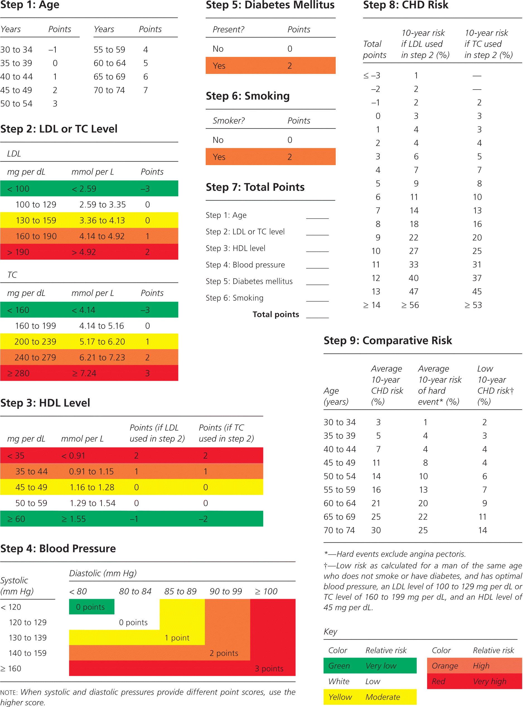

---
output:
  word_document: default
  pdf_document: default
  html_document: default
---

# Framingham package
r-framingham is a package used to estimate the 10-year cardiovascular risk of an individual using Framingham_Risk_Score standard guidelines https://en.wikipedia.org/wiki/Framingham_Risk_Score

The Framingham Risk Score is a gender-specific algorithm used to estimate the 10-year cardiovascular risk of an individual.

## Background

The Framingham 10 years risk score is based on the famous Framingham Heart Study which began in 1948 on a cohort of 5,209 men and women between the ages of 30 and 62 recruited from the town of Framingham, Massachusetts. Currently, the study is still ongoing with participation of the third generation, the grandchildren of the Original Cohort.

The goal of Framingham Study was to identify the common risk factors for developing Cardiovascular disease (CVD) by following its development in asymptomatic population with no history of heart attack or stroke.

The study concluded that major CVD risk factors are: high blood pressure, high blood cholesterol, smoking, obesity, diabetes, and physical inactivity. In addition to related factors such as blood triglyceride and HDL cholesterol levels, age, gender, and psychosocial issues.

Using Statistical tests which included age-adjusted linear regression or logistic regression to test for trends across blood pressure, TC, LDL-C, and HDL-C categories. Age-adjusted Cox proportional hazards regression and its accompanying c statistic were used to test for the relation between various independent variables and the CHD outcome and to evaluate the discriminatory ability of various prediction models. The 12-year follow-up was used in the proportional hazards models, and results were adapted to provide 10-year CHD incidence estimates. Separate score sheets were developed for each sex using TC and LDL-C categories. These sheets adapted the results of proportional hazards regressions by use of a system that assigned points for each risk factor based on the value for the corresponding β-coefficient of the regression analyses.
Then a score sheets for prediction of CHD using TC and LDL-C categorical variables were developed from the β-coefficients of Cox proportional hazards models. 

Adapted from: 
1.	Wilson PWF, D’Agostino RB, Levy D, Belanger AM, Silbershatz H, Kannel WB. Prediction of Coronary Heart Disease Using Risk Factor Categories. Circulation 1998;97(18):1837. 
2.	https://www.framinghamheartstudy.org/ 


## Framingham Algorithim

Below is an algorithim to follow inorder to generate Framingham score for Coronary Heart Disease (10-year risk)



 


### Usage
 This package can be used by statistician or data scientist in:
 
 * Survival analysis
 * Time series
 * Risk prediction
 * e.t.c
 
Example:  
```
your_data_frame %>%
group_by(patient_id) %>%
summarise( risk_score=calc_card_10(gender='gender',age='age',...)) # specify column name
```
 
 
### Installation

r-framingham is currently only available from github. To install it, run the following script.


```
# install.packages("devtools")
devtools::install_github("PHP2560-Statistical-Programming-R/r-framingham"): 

```

### Task Breakdown

* Nour - literature of Framingham and step 1 to 5
* Allan - setup r-package project requirements and step 5 to 10
* Triet Tran - implement bmi and non bmi score and heart age


## Built With

* [Package 1](http://www.github.com) - Package 1
* [Package 2](https://www.github.org) - Package 2
* [Package 3](https://www.github.io) - Package 3

## Contributing

Please read [CONTRIBUTING.md](https://github.com/PHP2560-Statistical-Programming-R/r-framingham/graphs/contributors) for details on our code of conduct, and the process for submitting pull requests to us.

## Versioning

We use git for versioning. For the versions available, see the [tags on this repository](https://github.com/your/project/tags). 

## Authors

* **Nour Audi** - *member* - [member](https://github.com/Nour-Audi)
* **Allan Kimaina** - *member* - [member](https://github.com/kimaina)
* **Triet Tran** - *member* - [member](https://github.com/ilbsm7)

See also the list of [contributors](https://github.com/PHP2560-Statistical-Programming-R/r-package-apollo) who participated in this project.

## License

This project is licensed under the MIT License - see the [LICENSE.md](LICENSE.md) file for details

## Acknowledgments
* https://www.framinghamheartstudy.org/
* Hat tip to anyone who's package was used
* Inspiration
* etc

