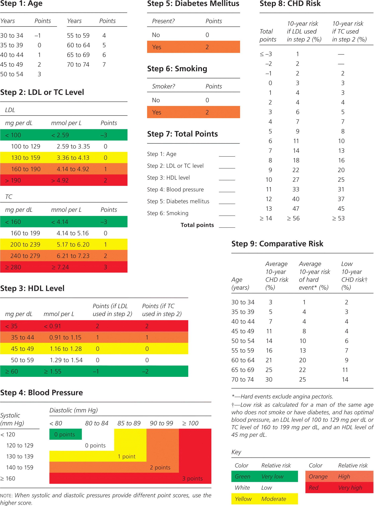

# Framingham package

One Paragraph of project description goes here

## package introduction 
the  Framingham score for Coronary Heart Disease (10-year risk)

 

These instructions will get you a copy of the project up and running on your local machine for development and testing purposes. See deployment for notes on how to deploy the project on a live system.

### Prerequisites

What things you need to install the software and how to install them

```
Give examples
```

### Installing

A step by step series of examples that tell you have to get a development env running

Say what the step will be

```
Give the example
```

And repeat

```
until finished
```

End with an example of getting some data out of the system or using it for a little demo

## Running the tests

Explain how to run the automated tests for this system

### Break down into end to end tests

Explain what these tests test and why

```
Give an example
```

### And coding style tests

Explain what these tests test and why

```
Give an example
```

## Deployment

Add additional notes about how to deploy this on a live system

## Built With

* [Package 1](http://www.github.com) - Package 1
* [Package 2](https://maven.github.org) - Package 2
* [Package 3](https://rometools.github.io) - Package 3

## Contributing

Please read [CONTRIBUTING.md](https://gist.github.com/PurpleBooth/b24679402957c63ec426) for details on our code of conduct, and the process for submitting pull requests to us.

## Versioning

We use [SemVer](http://semver.org/) for versioning. For the versions available, see the [tags on this repository](https://github.com/your/project/tags). 

## Authors

* **Nour Audi** - *member* - [member](https://github.com/Nour-Audi)
* **Allan Kimaina** - *member* - [member](https://github.com/kimaina)

See also the list of [contributors](https://github.com/PHP2560-Statistical-Programming-R/r-package-apollo) who participated in this project.

## License

This project is licensed under the MIT License - see the [LICENSE.md](LICENSE.md) file for details

## Acknowledgments

* Hat tip to anyone who's code was used
* Inspiration
* etc

